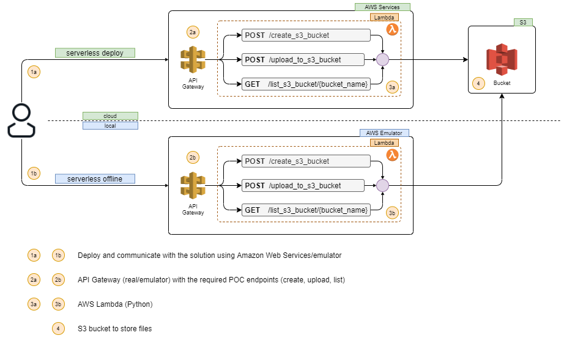

# AWS Serverless POC

## Table of contents:

- [Prerequisites](#prerequisites)
- [Environment setup](#env_setup)
- [Deployment](#deployment)
- [Launching and stopping the application in offline mode](#launch)
- [Run demo script](#demo)
- [cURL examples](#examples)
- [Application removal](#removal)
- [Stopping container](#stop)

## LCM



### Prerequisites <div id='prerequisites'/>

Small demo application which incorporates AWS API Gateway and several AWS Lambdas behind it. It has been tested with
macOS, but should work under Linux & Windows as well.

#### Software requirements

The following software is to be installed to start:

- `python` >= 3.8
- `pipenv`
- `docker` & `docker-compose`

### Environment setup <div id='env_setup'/>

(Linux or macOS. In Windows minor changes needed.)

#### Prepare python environment:

```
$ cd [repo root directory]
$ pipenv --python 3.8
$ pipenv shell
$ pipenv sync
$ pipenv sync --dev
```

#### List available tasks:

```
$ inv -l
>>
Available tasks:

  local.autopep8                 >> Run autocorrection on python files.
  serverless.deploy              >> Deploy serverless application.
  serverless.info                >> Serverless application status info. Including endpoints and api token.
  serverless.offline             >> Run serverless application in offline mode.
  serverless.rebuild-container   >> Build and run build container.
  serverless.remove              >> Remove serverless application.
  serverless.stop-container      >> Stop and remove sls container.

```

#### Export AWS credentials to authorize serverless

```
$ export AWS_REGION="[region here]"
$ export AWS_ACCESS_KEY_ID="[access key id here]"
$ export AWS_SECRET_ACCESS_KEY="[secret access key here]"

```

#### Make sure Docker is running

```
$ docker ps
>>
CONTAINER ID   IMAGE     COMMAND   CREATED   STATUS    PORTS     NAMES
```

#### Build and run the serverless container:

```
$ inv serverless.rebuild-container
```

### Deployment <div id='deployment'/>

```
$ inv serverless.deploy
```

### Launching and stopping the application in the offline mode <div id='launch'/>

#### Run offline api gateway emulator:

```
$ inv serverless.offline
```

#### Check available routes:

```
$ curl localhost:3000
>>
{
  "currentRoute": "get - /",
  "error": "Serverless-offline: route not found.",
  "existingRoutes": [
    "post - /prod/poc/create_s3_bucket",
    "get - /prod/poc/list_s3_bucket/{bucket_name}",
    "post - /prod/poc/upload_to_s3_bucket"
  ],
  "statusCode": 404
}
```

#### Stop and remove offline api gateway emulator:

```
$ inv serverless.stop-container
```

### Run demo script <div id='demo'/>

This will do the following:

* Create s3 bucket
* Generate several random files
* Upload them concurrently to s3
* In order to utilize API Gateway and Lambdas set endpoint and token (env: TEST_POC_API_KEY, env: BASE_URI). They can be
  found in the output of `inv serverless.info` command.

```
$ python demo.py
```

NB: do not forget to remove test s3 bucket!

### cURL examples <div id='examples'/>

* In the offline mode:

```
$ curl -X POST http://localhost:3000/prod/poc/create_s3_bucket -H 'x-api-key: <fake key>' --data '{"region": "us-east-1", "bucket_name": "uniqnamedbucket"}'
$ curl -X POST http://localhost:3000/prod/poc/upload_to_s3_bucket -H 'x-api-key: <fake key>' --data '{"bucket_name": "uniqnamedbucket"}'
$ curl -X GET  http://localhost:3000/prod/poc/list_s3_bucket/uniqnamedbucket -H "x-api-key: <fake key>"
```

* Utilizing real API Gateway:

```
$ curl -X POST http://[API GATEWAY ENGPOINT]/prod/poc/create_s3_bucket -H 'x-api-key: <real key>' --data '{"region": "us-east-1", "bucket_name": "uniqnamedbucket"}'
$ curl -X POST http://[API GATEWAY ENGPOINT]/prod/poc/upload_to_s3_bucket -H 'x-api-key: <real key>' --data '{"bucket_name": "uniqnamedbucket"}'
$ curl -X GET  http://[API GATEWAY ENGPOINT]/prod/poc/list_s3_bucket/uniqnamedbucket -H "x-api-key: <real key>"
```

### Application removal <div id='removal'/>

#### Remove application along with all related resources

```
$ inv serverless.remove
```

### Stopping container <div id='stop'/>

#### Stop and remove serverless container

```
$ inv serverless.stop-container
```
